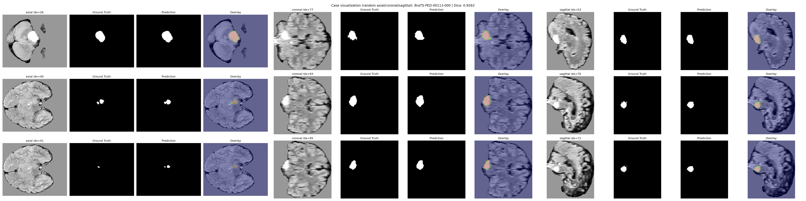
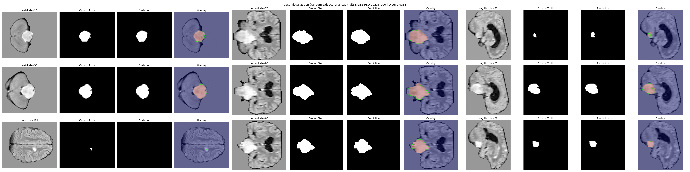

# SFU CMPT 419 Group 4 - Brain Tumor Segmentation from Multi-Modal MRI

This project focuses on brain tumor segmentation from multi-modal MRI using the BraTS-PED dataset. We build a practical deep learning pipeline to identify tumor regions from medical images, perform preprocessing and skull stripping, and generate visual outputs for inspection and evaluation.

## Important Links

| [Timesheet](https://1sfu-my.sharepoint.com/:x:/g/personal/hamarneh_sfu_ca/IQAtPLCC8kpkTYakaY8alc5VAeHsSEIQVSY9ADh8tmxwGig?e=WN7l1m) | [Slack channel](https://app.slack.com/client/T0A6UH0JBNH/C0AAKC8FYQZ) | [Project report](https://www.overleaf.com/5456891974cfybtrynfshj#0df937) |
| ----------------------------------------------------------------------------------------------------------------------------------- | --------------------------------------------------------------------- | --------------------------------------------------------------------------- |

- Timesheet: Sheet tracking individual contributions and time spent on the project.
- Slack channel: Link to the group Slack channel for communication and collaboration.
- Project report: Link to the project report document on Overleaf.

## Project Demo

This 2-minute demo showcases our brain tumor segmentation project using the BraTS-PED dataset. It gives a quick overview of the motivation, data, preprocessing and training workflow, and visual segmentation results. The focus is on showing the full pipeline in action and the quality of the final outputs.

[](https://drive.google.com/file/d/1p4udIJFLx-qYXKEcA9uoLHgg7Op-qzKI/view)

[Open the demo video](https://drive.google.com/file/d/1p4udIJFLx-qYXKEcA9uoLHgg7Op-qzKI/view)

## Project Results
Our best model achieved a validation Dice score of approximately 0.905 on the BraTS-PED training data. The model was trained for 400 epochs with a batch size of 2, using the `ReduceLROnPlateau` scheduler and an initial learning rate of `7e-4` that reduced to `1e-7`. Training and evaluation were performed on an RTX 4070 Ti GPU. Here are example visualizations of the model's segmentation outputs compared to the ground-truth labels:





Please refer to the `outputs/Results_After_400_epochs/` directory for more visualizations of test cases from our best model. Feel free to also check older results in `outputs/` to see how the model improved over time.

## Table of Contents

1. [Running the model](#model)

2. [Installation](#installation)

3. [Reproducing this project](#repro)

4. [Guidance](#guide)

5. [Contributors](#contributors)

<a name="model"></a>

## 1. Running the model

The repository includes our best trained model, `400epochs0905dice.pt`, in `models/`, with a corresponding split file in `models/split_files/`. You can use this model and split file to visualize results on the test split of the training data or on specific case IDs. It achieved a validation Dice score of approximately 0.905. There are other older models in `models/` that you can also explore, but `400epochs0905dice.pt` is our best-performing model.

### Quick start with the best provided model

Use this command to visualize random test cases using the best model and the provided split file:

```bash
python src\validation_visual.py --model .\models\400epochs0905dice.pt --data .\data_stripped\training --split-path .\models\split_files\split_data.json --i 3
```

Important: the split-file command expects the same dataset layout/case IDs used for training. If you do not have the full matching dataset locally, use a direct case-ID command instead.

If you want to visualize one specific case directly:

```bash
python src\validation_visual.py --model .\models\400epochs0905dice.pt --data .\data_stripped\training --case-id BraTS-PED-00073-000
```

If you only have sample stripped data, use:

```bash
python src\validation_visual.py --model .\models\400epochs0905dice.pt --data .\sample_data\training_stripped --case-id BraTS-PED-00013-000
```


### Repository structure

The project repository is organized as follows:

```bash
repository
├── src                          ## Model files and dependency installer
  ├── base_version_conda         ## Original base version implementation
  ├── skull_stripping            ## Contains code related to skull stripping using SynthStrip and Docker
  ├── install_deps.py            ## Dependency installer for the project
  ├── loadmodel.py               ## Helper file to load a model from a given checkpoint
  ├── main.py                    ## Python file to run the model with different modes and arguments
  ├── trainmodel.py              ## Python file to train the model and save model checkpoints
  ├── validation_visual.py       ## Python file to visualize trained model outputs
├── README.md                    ## You are here
├── requirements.txt             ## Python dependencies for running this project
```

<a name="installation"></a>

## 2. Installation

Our project uses Torch (v2.10.0) and CUDA (v13.0) for training. The steps below install those versions; if your machine uses different versions, please refer to the [Torch](https://pytorch.org/get-started/locally/) website.

```bash
git clone $THISREPO
cd $THISREPO
python -m venv .venv
# Windows PowerShell
.venv\Scripts\Activate.ps1
# run provided dependency installer
python src\install_deps.py --upgrade-pip
# if you plan to use CUDA-enabled PyTorch
python src\install_deps.py --upgrade-pip --cuda

# manually install project requirements
python -m pip install -r requirements.txt
# If you plan to use CUDA-enabled PyTorch
python -m pip uninstall -y torch torchvision torchaudio
python -m pip install torch torchvision torchaudio --index-url https://download.pytorch.org/whl/cu130
```

<a name="repro"></a>

## 3. Reproduction

To reproduce the results of this project and train the model from scratch, download the BraTS-PED dataset and organize it in the same directory as this repository.

### Reproduction checklist

1. Install dependencies from Section 2.
2. Download and arrange BraTS-PED under `data/training` and `data/validation`.
3. Run skull stripping to generate `data_stripped/training` and `data_stripped/validation`.
4. Train/evaluate with `src/main.py` commands in Section 3.3.
5. Visualize outputs with `src/validation_visual.py` commands in Section 1.

### 3.1 Dataset setup

Start by downloading the BraTS-PED dataset from the [Cancer Imaging Archive](https://www.cancerimagingarchive.net/collection/brats-peds/). Move the whole folder containing the training data to the same directory as this repository and rename it to `data`. The expected structure should look like this:

```text
data/
  training/
    BraTS-PED-xxxxx-000/
      *_t1n.nii.gz, *_t1c.nii.gz, *_t2f.nii.gz, *_t2w.nii.gz, *_seg.nii.gz
  validation/
    BraTS-PED-xxxxx-000/
      *_t1n.nii.gz, *_t1c.nii.gz, *_t2f.nii.gz, *_t2w.nii.gz
```
Since this dataset is for the BraTS-PED challenge, the validation set does not contain labels. For training, only labeled training data is used. The validation set can be used for qualitative testing and visualization after training.

### 3.1.1 Sample Dataset
We have included a small sample of BraTS-PED data in `sample_data/` for quick testing and debugging. The current sample contains 10 cases total: 8 in `sample_data/training` and 2 in `sample_data/validation`. You can use this sample to quickly test the skull-stripping and training pipeline before running on the full dataset. We also provide skull-stripped sample data in `sample_data/training_stripped` and `sample_data/validation_stripped` (currently 8 and 2 cases, respectively) if you want to skip the skull-stripping step during quick tests.

### 3.2 Skull stripping

To effectively train the brain tumor segmentation model, first perform skull stripping on the MRI data. This preprocessing step removes non-brain tissues from the scans so the model can focus on tumor-relevant brain regions.

We use [synthstrip](https://github.com/freesurfer/freesurfer/tree/9f94380e7b134a4dea660f60d412c4cb4dd34144/mri_synthstrip) running in a [Docker](https://www.docker.com/) container.

You will need to have [Docker](https://www.docker.com/) installed and running on your machine to use the provided script for building the synthstrip GPU image. Once you have Docker set up, you can run the following command to build the image and perform skull stripping on your data:

```bash
powershell -ExecutionPolicy Bypass -File src/skull_stripping/build_synthstrip_gpu_image.ps1

python src\skull_stripping\skull_strip.py --data-dir data --output-dir data_stripped
```

After running the skull stripping script, you should have a new folder called `data_stripped` in the same directory as this repository. The expected structure of the `data_stripped` folder should look like this:

```text
data_stripped/
  training/
    BraTS-PED-xxxxx-000/
      brain_mask.nii.gz, *_t1n.nii.gz, *_t1c.nii.gz, *_t2f.nii.gz, *_t2w.nii.gz, *_seg.nii.gz
  validation/
    BraTS-PED-xxxxx-000/
      brain_mask.nii.gz, *_t1n.nii.gz, *_t1c.nii.gz, *_t2f.nii.gz, *_t2w.nii.gz
```
Input/output expectations for `skull_strip.py`:

- Input root (`--data-dir`) should contain `training/` and optionally `validation/`.
- Each case folder is expected to include exactly one of each modality: `*t1n.nii.gz`, `*t1c.nii.gz`, `*t2f.nii.gz`, `*t2w.nii.gz`.
- If `*seg.nii.gz` exists, it is copied into the output case folder.
- Output root (`--output-dir`) is created automatically if needed and mirrors split/case names.

For our training and testing, we use skull-stripped data in `data_stripped/training`. As `data_stripped/validation` does not contain labels, it can be used for testing and visualization after training if needed. The training script automatically discovers all cases in `data_stripped/training` and performs an internal train/validation/test split for training and evaluation.

### 3.3 Training and evaluation

The commands below cover standard training, train-only mode, test-flow evaluation, resuming from checkpoints, and split replay for reproducibility.

### Training and testing with main.py

`main.py` provides three execution modes for training and evaluation:

#### Mode guide

- Default mode (no flags): performs an 80/20 train/validation split on discovered cases and evaluates on the validation split after training.
- `--train` mode: uses all discovered cases for training only (no post-training evaluation).
- `--test` mode: performs a train/validation/test split and evaluates on the test split after training.

#### Full argument list

| Argument | Type | Default | Description |
|----------|------|---------|-------------|
| `--train` | flag | - | Use all discovered cases for training only (mutually exclusive with `--test`) |
| `--test` | flag | - | Train/validation/test split with evaluation on test split (mutually exclusive with `--train`) |
| `--data-dir` | string | required | Path to exact folder containing BraTS case folders (e.g., `.\data_stripped\training`) |
| `--epochs` | int | 10 | Number of training epochs |
| `--batch-size` | int | 1 | Batch size for training and validation |
| `--lr` | float | None | Optional learning rate override. On resume, overrides checkpoint LR only when provided |
| `--lr-scheduler` | choice | `reduce_on_plateau` | Learning-rate scheduler mode: `reduce_on_plateau` or `none` |
| `--lr-patience` | int | 3 | Epochs to wait before reducing LR when using `reduce_on_plateau` |
| `--lr-factor` | float | 0.5 | Multiplicative factor for LR reduction |
| `--lr-min` | float | 1e-7 | Minimum learning-rate floor |
| `--seed` | int | 67 | Random seed for reproducible splitting |
| `--train-ratio` | float | 0.75 | Ratio used for training in `--test` mode |
| `--val-ratio` | float | 0.15 | Ratio used for validation in `--test` mode |
| `--num-workers` | int | 0 | Number of data-loading workers |
| `--device` | choice | `auto` | `auto`, `cuda`, or `cpu` |
| `--use-split-file` | string | None | Path to split JSON file for reproducible split replay |
| `--checkpoint-dir` | string | `checkpoints` | Directory for checkpoints and split records |
| `--checkpoint-path` | string | None | Optional explicit checkpoint path |
| `--resume-from` | string | None | Checkpoint path for resuming training |

#### Training and testing commands

```bash
# default: 80/20 train/validation split, then validation Dice evaluation
python src/main.py --data-dir .\data_stripped\training --device cuda

# train only: use all discovered cases (no evaluation)
python src/main.py --train --data-dir .\data_stripped\training --device cuda

# test flow: train with custom train/val/test split, then evaluate on test split
python src/main.py --test --data-dir .\data_stripped\training --device cuda --train-ratio 0.75 --val-ratio 0.15

# resume training and keep checkpoint optimizer LR
python src/main.py --test --data-dir .\data_stripped\training --resume-from .\checkpoints\checkpoint_epoch_10.pt --use-split-file .\checkpoints\splits\split_data.json

# resume training and override LR (only because --lr is explicitly provided)
python src/main.py --test --data-dir .\data_stripped\training --resume-from .\checkpoints\checkpoint_epoch_10.pt --use-split-file .\checkpoints\splits\split_data.json --lr 8e-5

# disable scheduler for fixed LR behavior
python src/main.py --test --data-dir .\data_stripped\training --lr-scheduler none --lr 5e-5

# optional replay: reuse a saved split record for reproducible experiments
python src/main.py --test --data-dir .\data_stripped\training --use-split-file .\checkpoints\splits\split_data.json

# visualize one random case from the test split using a checkpoint and split record
python src/validation_visual.py --model .\checkpoints\checkpoint_epoch_10.pt --data .\data_stripped\training --split-path .\checkpoints\splits\split_data.json --i 1

# visualize a specific case directly (no split file needed)
python src/validation_visual.py --model .\checkpoints\checkpoint_epoch_10.pt --data .\data_stripped\training --case-id BraTS-PED-00073-000
```

#### Sample command used in our project

```bash
python src\main.py --test --data-dir .\data_stripped\training --checkpoint-dir .\checkpoints\run_200 --resume-from .\checkpoints\run_200\checkpoint_epoch_400.pt --use-split-file .\checkpoints\run_200\splits\split_data.json --epochs 2 --batch-size 2 --num-workers 10 --train-ratio 0.75 --val-ratio 0.15 --lr 7e-4 --lr-scheduler reduce_on_plateau --lr-patience 8 --device cuda
```

This run resumes from epoch 400, reuses the saved split for reproducibility, trains 2 additional epochs with batch size 2 and 10 workers, uses `--test` split mode (`0.75/0.15/0.10`), applies LR `7e-4` with `reduce_on_plateau` scheduler (`patience=8`), and evaluates on the test split.

#### Learning-rate behavior summary

- Fresh training without `--lr`: uses project default LR (`1e-4`).
- Fresh training with `--lr`: uses the provided value.
- Resume with `--resume-from` and no `--lr`: keeps checkpoint optimizer LR.
- Resume with `--resume-from` and `--lr`: overrides checkpoint LR with provided value.

#### Scheduler behavior summary

- Default scheduler is `ReduceLROnPlateau` (monitors validation Dice and lowers LR on plateau).
- Scheduler updates are skipped when no validation metric is available (for example in `--train` mode).
- Scheduler state is saved in checkpoints and restored on resume.

#### Split constraints and reproducibility

- In `--test` mode, both `--train-ratio` and `--val-ratio` must be between 0 and 1, and their sum must be less than 1.
- Minimum case count: train/val needs at least 2 cases, and train/val/test needs at least 3 cases.
- Split records are saved to `checkpoints/splits/split_data.json`; reusing that file with `--use-split-file` keeps comparisons fair across runs.

#### Device behavior

- `--device auto` (default): uses CUDA when available, otherwise CPU.
- `--device cuda`: requires CUDA and raises an error if CUDA is unavailable.
- `--device cpu`: always uses CPU.

#### Visualization
After training, use `validation_visual.py` as shown in section 1, [Running the model](#model), to visualize model outputs or follow the instructions below. You can specify a case ID directly or visualize random cases from the test split of your training data by providing the split file.

Visualization command options:

- `--model`: Path to the trained model.
- `--data`: Path to the folder containing skull-stripped data used for segmentation.
- `--split-path`: Path to split JSON file used to select random test cases from training data.
- `--case-id`: Exact case ID to visualize directly from data.
- `--i`: Number of random test cases to visualize.

```bash
# visualize a specific case directly (no split file needed)
python src\validation_visual.py --model .\YourModelPath --data .\YourDataPath --case-id YourCaseID

# visualize random cases from the split file
python src\validation_visual.py --model .\YourModelPath --data .\YourDataPath --split-path .\YourSplitPath --i 3
```

<a name="guide"></a>

## 4. Guidance

### Training recommendations

- Prefer CUDA for training. On an RTX 4070 Ti, one epoch takes about 2.5 minutes on average in our setup.
- Avoid CPU training unless you are only debugging, since runtime is significantly longer.
- If you hit GPU memory issues, reduce `--batch-size` first.
- Use a dedicated `--checkpoint-dir` per experiment run to keep results organized.
- Keep `--use-split-file` when resuming or comparing runs so train/val/test partitions remain consistent.
- Save the exact command used for each experiment (including LR and scheduler settings) for reproducibility.

<a name="contributors"></a>

## 5. Contributors

- Asifiwe Julio Patrick
- Haoran Miao
- Kalpana Kalpana
- Ridham Sharma
